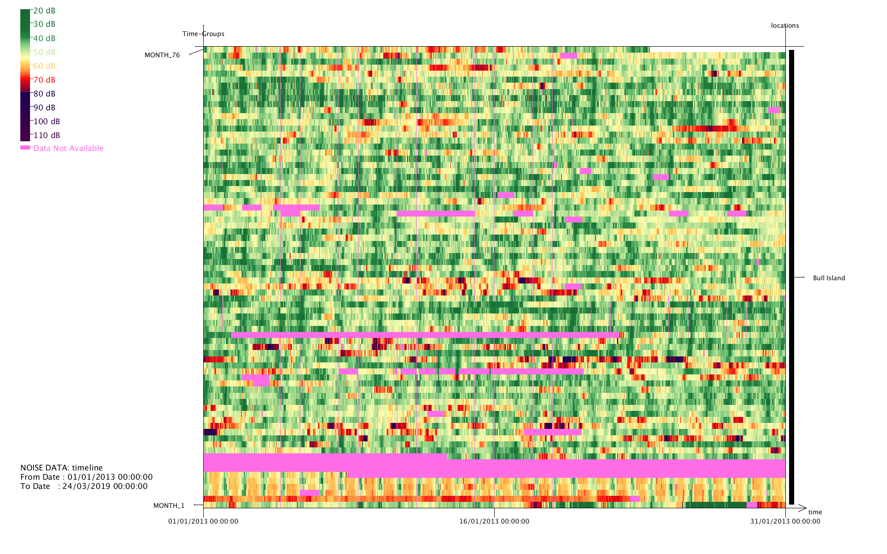

# NoiseLevelsInDublin

Steps to setup:
1. Download all the data files from: https://drive.google.com/drive/folders/1ticHZA_RtN3GMz87drXKPaiav97Py3iu?usp=sharing
2. Copy the whole 'data' folder to the project folder
2. Use Processing to open the project
3. Run the project

#Download Data from: 
https://drive.google.com/drive/folders/1ticHZA_RtN3GMz87drXKPaiav97Py3iu?usp=sharing

#Visualization artefact:
https://drive.google.com/drive/folders/1ENwxrUWp_3abmAaYwFjmFGf4Z9yrv_2i?usp=sharing

#Presentation:
https://drive.google.com/drive/folders/1h1ezBuPyjDiCsP3vOw-fwHgpBii4ig8S?usp=sharing

#Thumbnail:
https://drive.google.com/drive/folders/1gFYdoLk6O9KapWIxlo9XK6Na8NAUHrOV?usp=sharing

#Other Files:
https://drive.google.com/open?id=1HlOwqZs8w4OFV9hmBWwgcMmHBCWJ1CJZ

#Screenshots:

